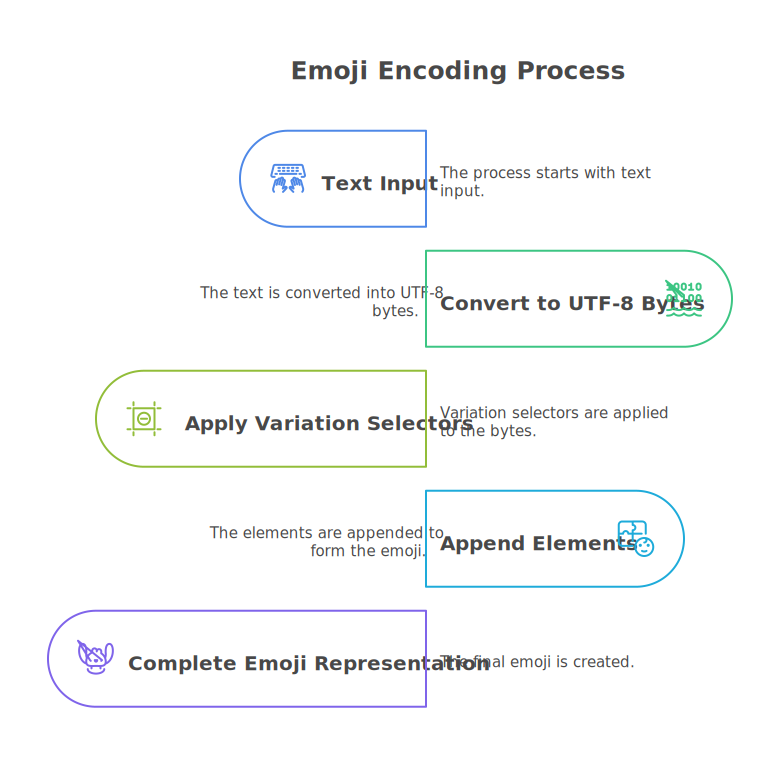
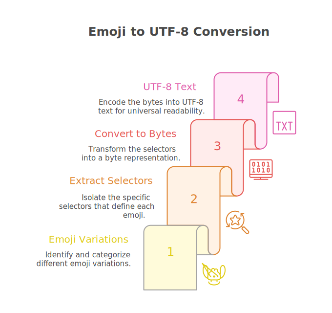

<p style="text-align:center;" align="center">
  
</p>
<h1 align="center">🔐 Emoji Encoder Bot</h1>

<div align="center">

[](https://t.me/EmojiEncoderBot)
[](https://www.rust-lang.org/)
[](LICENSE)

</div>

<h4 align="center">Hide Secret Messages & Files Inside Emojis! 🤫✨</h4>

<div align="center">
  - A light-weight Telegram bot that hides text messages and files inside emojis! -
  <br/>
  <sup><sub>🦀 Crashing is not an option. It's built with Rust ツ</sub></sup>
</div>

## 🎯 Features

- 🔐 **Encode Messages** - Hide any text inside emojis using invisible Unicode characters
- 📁 **Encode Files** - Hide files (photos, videos, stickers, documents, etc.) inside emojis
- 🔓 **Auto-Decode** - Automatically detects and reveals hidden messages or files
- 🎲 **Random Emoji** - Let the bot pick a random emoji for you
- ✏️ **Custom Emoji** - Use any emoji you want
- 💬 **Inline Mode** - Encode messages directly in any chat
- 📊 **Admin Stats** - Track bot usage with detailed statistics
- 🐳 **Docker Ready** - Easy deployment with Docker Compose
- ☁️ **Cloud Compatible** - Deploy to Railway, Heroku, Render, and more

## 🎬 Demo


## 🚀 Quick Start

### Option 1: Docker Compose (Recommended)

Using pre-built image from GitHub Container Registry:

```bash
# Clone the repository
git clone https://github.com/Malith-Rukshan/Emoji-Encoder-Bot.git
cd Emoji-Encoder-Bot

# Configure environment
cp .env.example .env
# Edit .env and add your BOT_TOKEN

# Start the bot with MongoDB (uses pre-built image)
docker-compose up -d

# View logs
docker-compose logs -f bot
```

### Option 2: Docker Compose (Build from Source)

Build the image locally:

```bash
# Clone the repository
git clone https://github.com/Malith-Rukshan/Emoji-Encoder-Bot.git
cd Emoji-Encoder-Bot

# Configure environment
cp .env.example .env
# Edit .env and add your BOT_TOKEN

# Start the bot with MongoDB (builds locally)
docker-compose -f docker-compose.build.yml up -d

# View logs
docker-compose -f docker-compose.build.yml logs -f bot
```

### Option 3: Local Development

```bash
# Prerequisites: Rust 1.90+
git clone https://github.com/Malith-Rukshan/Emoji-Encoder-Bot.git
cd Emoji-Encoder-Bot

# Configure environment
cp .env.example .env
# Edit .env and add your BOT_TOKEN

# Build and run
cargo build --release
cargo run --release
```

## ☁️ Deploy to Cloud

### 🚀 One-Click Deploy

**Deploy instantly to your favorite cloud platform with pre-configured settings!**

[](https://railway.app/)
[](https://cloud.digitalocean.com/apps/new?repo=https://github.com/Malith-Rukshan/Emoji-Encoder-Bot/tree/main)</br>
[](https://render.com/deploy?repo=https://github.com/Malith-Rukshan/Emoji-Encoder-Bot)
[](https://heroku.com/deploy?template=https://github.com/Malith-Rukshan/Emoji-Encoder-Bot)

### 🔨 Manual Cloud Deployment

#### Railway.app
1. Fork this repository
2. Create new project on Railway
3. Connect your GitHub repository
4. Add environment variables:
   - `BOT_TOKEN` (required)
   - `MONGODB_URI` (optional - use Railway's MongoDB plugin)
   - `ADMIN_IDS` (optional)
5. Deploy!

#### Heroku
```bash
heroku create your-emoji-bot
heroku config:set BOT_TOKEN=your_token_here
heroku config:set MONGODB_URI=your_mongodb_uri
git push heroku main
```

#### Render.com
1. Create new Web Service
2. Connect repository
3. Use Docker runtime
4. Add environment variables
5. Deploy

---

## ⚙️ Configuration

### Environment Variables

| Variable | Required | Description | Default |
|----------|----------|-------------|---------|
| `BOT_TOKEN` | ✅ Yes | Telegram bot token from [@BotFather](https://t.me/BotFather) | - |
| `MONGODB_URI` | ❌ No | MongoDB connection string | - |
| `MONGO_USERNAME` | ❌ No | MongoDB username (Docker Compose) | `emojibot` |
| `MONGO_PASSWORD` | ❌ No | MongoDB password (Docker Compose) | `emojibot123` |
| `ADMIN_IDS` | ❌ No | Comma-separated admin user IDs | - |
| `RUST_LOG` | ❌ No | Logging level | `info` |

### Getting Your User ID
Send `/start` to [@userinfobot](https://t.me/userinfobot) on Telegram

---

## 📖 Usage

### In Private Chat

**For Text:**
1. **Send text** to the bot
2. **Choose an emoji** from the grid (or Random/Custom)
3. **Share the encoded emoji anywhere!**
4. **Send encoded emoji back** to automatically decode

**For Files:**
1. **Send any file** (photo, video, sticker, document, audio, voice, video note, animation)
2. **Choose an emoji** from the grid (or Random/Custom)
3. **Share the encoded emoji!**
4. **Send encoded emoji back** to receive the original file

### In Groups

Use commands to encode/decode messages and files:
- `/encode <text>` - Encode text with random emoji
- `/encode` (as reply) - Encode the replied message or file
- `/decode <emoji>` - Decode hidden message or file from emoji
- `/decode` (as reply) - Decode the replied message or file

### Inline Mode

Type in any chat:
```
@EmojiEncoderBot 😎 Secret message here
```
Select from the results to send the encoded emoji directly!

### All Commands

- `/start` - Start the bot
- `/help` - Show help message with usage instructions
- `/about` - About this bot
- `/encode <text>` - Encode text or reply to a message
- `/decode <emoji>` - Decode emoji or reply to a message
- `/stats` - View bot statistics (admin only)

---

## 🔬 How Does It Work?

The bot uses a clever Unicode trick called **Variation Selectors** to hide data:

### The Magic Behind Encoding

Unicode has special invisible characters called **Variation Selectors**:
- **VS1-VS16** (U+FE00 to U+FE0F) - 16 variations
- **VS17-VS256** (U+E0100 to U+E01EF) - 240 variations

These 256 variations perfectly map to all possible byte values (0-255)!

### The Process

**For Text:**

1. **Encoding**: Your text → UTF-8 bytes → Variation selectors → Appended to emoji

   

   ```
   Text: "Hello"
   Bytes: [72, 101, 108, 108, 111]
   Result: 😀[VS73][VS102][VS109][VS109][VS112]
   ```

2. **Decoding**: Emoji with variations → Extract selectors → Convert to bytes → UTF-8 text

   

**For Files:**

1. **Encoding**: File's unique Telegram file_id → Prefixed with "TG_FILE_" → UTF-8 bytes → Variation selectors → Appended to emoji

   ```
   File ID: "AgACAgIAAxkBAAI..."
   Prefixed: "TG_FILE_AgACAgIAAxkBAAI..."
   Result: 🎭[VS84][VS71][VS95][VS70]...[encoded file_id]
   ```

2. **Decoding**: Emoji with variations → Extract selectors → Convert to bytes → Detect "TG_FILE_" prefix → Extract file_id → Send original file

The encoded emoji looks completely normal but contains hidden data! 🎩✨

### Supported File Types

- 📷 **Photos** - Any image sent to Telegram
- 🎬 **Videos** - Video files
- 🎵 **Audio** - Music and audio files
- 📄 **Documents** - Any document files
- 🎭 **Stickers** - Telegram stickers
- 🎤 **Voice** - Voice messages
- 🎥 **Video Notes** - Round video messages
- 🎞️ **Animations** - GIFs and animations

## 🛠️ Tech Stack

- **Language**: Rust 🦀
- **Framework**: [Teloxide 0.17](https://github.com/teloxide/teloxide)
- **Runtime**: [Tokio 1.47](https://tokio.rs/)
- **Database**: [MongoDB 3.x](https://www.mongodb.com/) (optional)

### Key Features
- ⚡ **High Performance** - Built with Rust for maximum speed
- 🪶 **Lightweight** - Only ~14MB binary size, ~17MB RAM usage
- 🧠 **In-Memory State** - No database overhead for conversations
- 📊 **Optional Stats** - Works with or without MongoDB
- 🔄 **Auto-Reconnect** - Resilient to network issues
- 🐳 **Containerized** - Production-ready Docker setup
- 📦 **Pre-built Images** - Available on GitHub Container Registry

---

## 🐳 Docker Images

Pre-built Docker images are automatically published to GitHub Container Registry on every push to main branch.

### Available Images

- **Latest**: `ghcr.io/malith-rukshan/emoji-encoder-bot:latest`
- **Branch-based**: `ghcr.io/malith-rukshan/emoji-encoder-bot:main-<sha>`

### Using Docker Image

```bash
# Pull the latest image
docker pull ghcr.io/malith-rukshan/emoji-encoder-bot:latest

# Run directly
docker run -e BOT_TOKEN=your_token ghcr.io/malith-rukshan/emoji-encoder-bot:latest

# Or use docker-compose.yml (recommended)
docker-compose up -d
```

### Building Locally

If you prefer to build from source:

```bash
# Build from source
docker-compose -f docker-compose.build.yml up -d

# Or build manually
docker build -t emoji-encoder-bot .
```

---

## 📊 Bot Statistics

The `/stats` command (admin only) shows:

**Database Stats:**
- 👥 Total Chats
- 🧑 Private Users
- 👥 Groups
- 📢 Channels

**System Stats:**
- 🧠 CPU Usage
- 💾 RAM Usage

---

## 🤝 Contributing

Contributions are welcome! Please feel free to submit a Pull Request.

1. Fork the repository
2. Create your feature branch (`git checkout -b feature/AmazingFeature`)
3. Commit your changes (`git commit -m 'Add some AmazingFeature'`)
4. Push to the branch (`git push origin feature/AmazingFeature`)
5. Open a Pull Request

---

## 📝 License

This project is licensed under the MIT License - see the [LICENSE](LICENSE) file for details.

## 🙏 Acknowledgments

This project was inspired by the work of paulgb and built using the wonderful Teloxide library and the Rust programming language.

## 👨‍💻 Developer

**Malith Rukshan**
- 🌐 Website: [malith.dev](https://malith.dev)
- 📧 Email: hello@malith.dev
- 🐦 Telegram: [@MalithRukshan](https://t.me/MalithRukshan)

## ⭐ Star History

<div align="center">

[](https://star-history.com/#Malith-Rukshan/Emoji-Encoder-Bot&Date)

**If you find this project useful, please consider giving it a ⭐!**

Made with Rust 🦀

[🚀 Try the Bot](https://t.me/EmojiEncoderBot) • [⭐ Star on GitHub](https://github.com/Malith-Rukshan/Emoji-Encoder-Bot)

</div>
